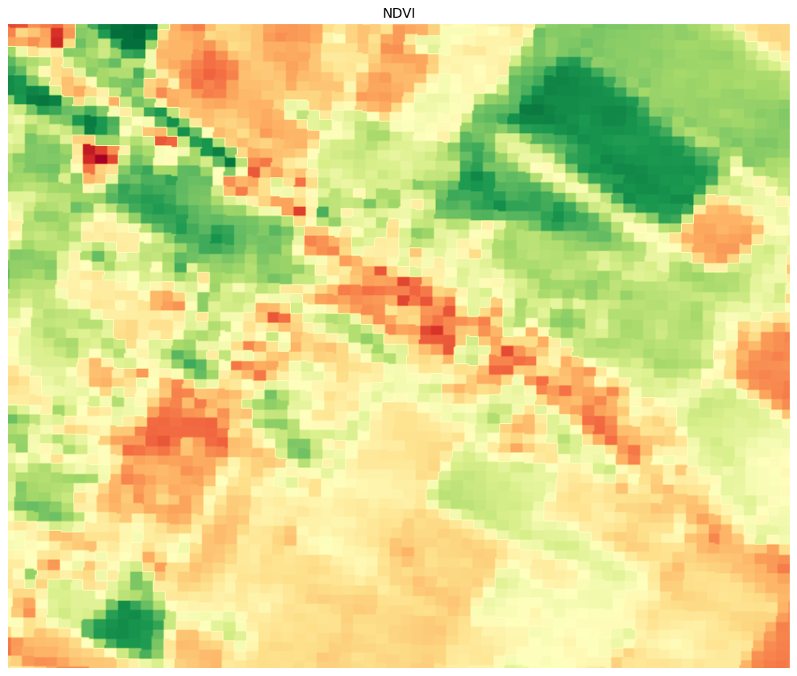
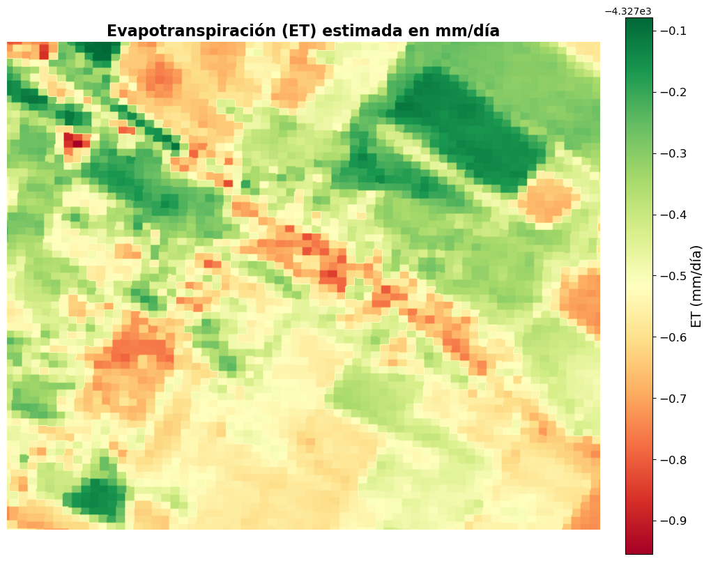
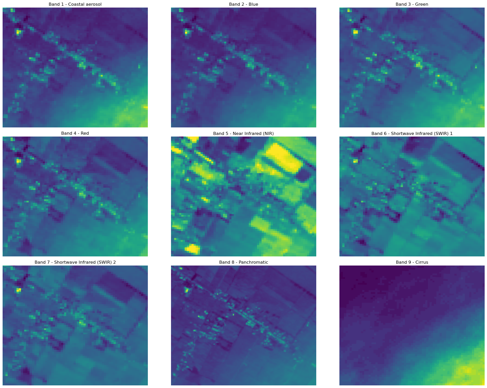

# 🍃 Labkence: EvapoTranspiration Analyzer

We present Labkence, a disruptive platform that utilizes NASA’s satellite data at the service of smallholder farmers, specially in Chile. This way, Labkence will empower them to take critical water-related decisions informed with real data. Our platform not only delivers key metrics to farmers but also translates this data into simple, manageable insights tailored to general information about the farmer's land and resources. 

$$ET = \frac{R_n - G - H}{\lambda}$$


|  |  |
| :---: | :---: |
|  |  |





## Table of Contents
- [Introduction](#introduction)
- [Installation](#installation)
- [Usage](#usage)
  - [Jupyter Notebook](#running-the-jupyter-notebook)
  - [FastAPI](#running-the-fastapi-app)
- [Requirements](#requirements)
- [Contributing](#contributing)
- [License](#license)


## Introduction


Evapotranspiration (ET) is calculated using following the energy balance equation:

$$ET = \frac{R_n - G - H}{\lambda}$$

Where:
- **$R_n$** = Net radiation = $0.5 \frac{W}{m²}$
- **$G$** = Soil heat flux
- **$H$** = Sensible heat flux
- **$\lambda$** = Latent heat of vaporization = $2.45 × 10⁶ \frac{J}{kg}$

### Component Calculations

**Soil Heat Flux:**
$$G = R_n \left(0.05 + 0.18 \cdot e^{-0.521 \times NDVI}\right)$$

**Sensible Heat Flux:**
$$H = \frac{\rho C_p (T_s - T_a)}{r_a}$$

Where:
- **$\rho$** = Air density
- **$C_p$** = Specific heat of air
- **$T_s$** = Surface temperature
- **$T_a$** = Air temperature
- **$r_a$** = Aerodynamic resistance
- **$NDVI$** = Normalized Difference Vegetation Index, calculated from Landsat bands.

[img]

## Installation

1. Clone the repository:

    ```bash
    git clone https://github.com/your-username/your-repo-name.git
    cd your-repo-name
    ```

2. Set up a virtual environment (optional but recommended):

    ```bash
    python3 -m venv venv
    source venv/bin/activate  # On Windows: venv\Scripts\activate
    ```

3. Install the required dependencies:

    ```bash
    pip install -r requirements.txt
    ```

## Usage

### Running the FastAPI App


1. Start the FastAPI server:

    ```bash
    uvicorn main:app --reload
    ```

    The `--reload` flag enables auto-restart on code changes during development.

2. Access the FastAPI app at `http://127.0.0.1:8000`.

3. View the interactive API documentation:

    - Swagger UI: `http://127.0.0.1:8000/docs`
    - Redoc: `http://127.0.0.1:8000/redoc`

4. Available endpoints:
    - `GET /` - Welcome message
    - `GET /data` - Sample DataFrame response
    - `GET /get-image/{lat}/{lon}` - Get satellite image at coordinates
    - `GET /get-asd/` - Get ET image
    - `GET /get-polygon-image/{x1}/{y1}/{x2}/{y2}/{x3}/{y3}/{x4}/{y4}` - Get image for polygon region

### Running the example Jupyter Notebook

1. Start the Jupyter Notebook server:

    ```bash
    jupyter notebook
    ```

2. Open the `ET_processing.ipynb` file from the Jupyter interface.

## Requirements

All dependencies are listed in the `requirements.txt` file. You can install them using the following command:

```bash
pip install -r requirements.txt
```
